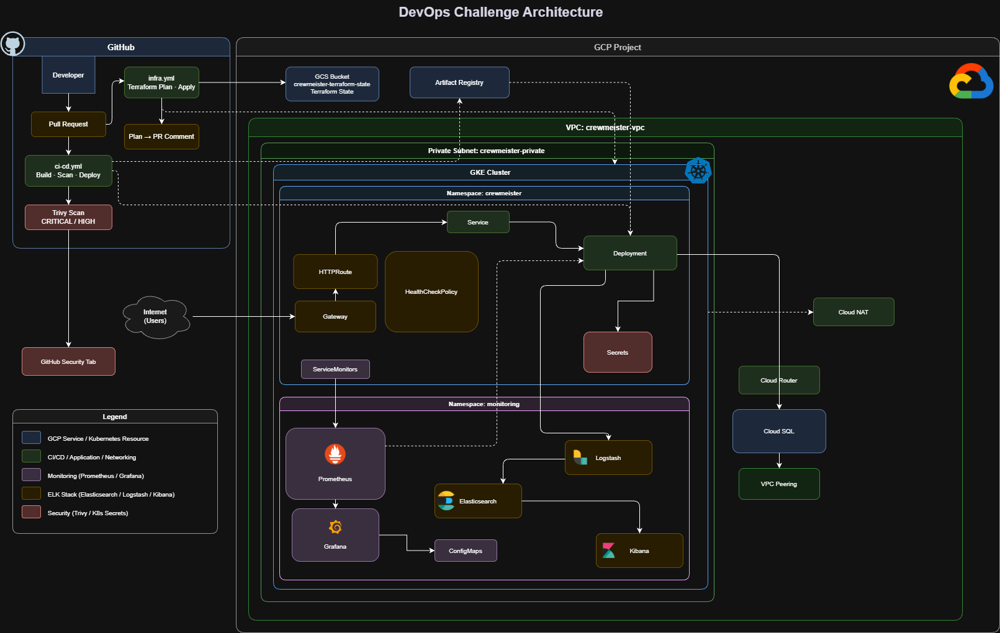

# DevOps Challenge

> Complete lifecycle implementation of a Spring Boot user management API on GCP, containerized, infrastructure-as-code, Kubernetes-native, fully automated CI/CD, and production-grade observability.

---

## Table of Contents

- [Overview](#overview)
- [Architecture](#architecture)
- [Repository Structure](#repository-structure)
- [Application](#application)
- [Infrastructure](#infrastructure)
- [Kubernetes & Helm](#kubernetes--helm)
- [CI/CD Pipelines](#cicd-pipelines)
- [Observability](#observability)
- [Security](#security)
- [Local Development](#local-development)
- [Deployment Guide](#deployment-guide)
- [GitHub Secrets Reference](#github-secrets-reference)
- [Points of Improvement](#points-of-improvement)

---

## Overview

This project implements the full DevOps lifecycle for a Spring Boot REST API, from local development to production on GCP. Every layer, networking, compute, database, deployment, observability, is defined as code and automated through GitHub Actions pipelines.

```
Pull Request opened
       │
       ├─ ci-cd.yml ──► Build → Trivy scan → Push → Helm deploy
       └─ infra.yml ──► Terraform plan → PR comment → Manual approval → Apply
```

| Layer | Stack |
|---|---|
| Application | Spring Boot 3.3.5 · Java 17 · MySQL 8.0 · Flyway |
| Container | Docker multi-stage · GCP Artifact Registry |
| Infrastructure | Terraform 1.8 · GKE · Cloud SQL · VPC · Cloud NAT |
| Kubernetes | Helm 3 · Gateway API · ServiceMonitor · HealthCheckPolicy |
| CI/CD | GitHub Actions |
| Security | Trivy · K8s Secrets · Private networking |
| Observability | Prometheus · Grafana · Elasticsearch · Logstash · Kibana |

---

## Architecture

All workloads run in a fully private topology. GKE nodes and Cloud SQL have no public IPs, egress flows through Cloud NAT, ingress through a managed L7 Gateway.



## Repository Structure

```
.
├── .github/workflows/
│   ├── ci-cd.yml                   # Build · Scan · Push · Helm deploy
│   └── infra.yml                   # Terraform plan → PR comment → apply
│
├── src/main/resources/
│   ├── application.yml             # 12-factor config, fully env-var driven
│   └── logback-spring.xml          # JSON console + Logstash TCP (logstash profile)
│
├── helm/
│   ├── crewmeister/                # Application chart
│   │   ├── Chart.yaml
│   │   ├── values.yaml             # Non-sensitive defaults only
│   │   └── templates/
│   │       ├── deployment.yaml
│   │       ├── service.yaml
│   │       ├── gateway.yml         # GKE Gateway API
│   │       ├── httproute.yaml
│   │       ├── healthcheckpolicy.yaml
│   │       ├── db-secret.yaml
│   │       ├── ServiceMonitor.yaml
│   │       ├── grafana-dashboard.yaml
│   │       └── _helpers.tpl
│   └── monitoring/                 # Observability stack values
│       ├── kube-prometheus-stack-values.yaml
│       ├── elasticsearch-values.yaml
│       ├── kibana-values.yaml
│       └── logstash-values.yaml
│
├── Infra/
│   ├── main.tf                     # Providers · modules · VPC peering
│   ├── variables.tf
│   ├── outputs.tf
│   └── modules/
│       ├── vpc/                    # VPC · subnet · Cloud Router · Cloud NAT
│       ├── gke/                    # Private cluster · node pool · Gateway API
│       ├── cloudsql/               # MySQL 8.0 · private IP · peering
│       ├── artifact-registry/
│       └── monitoring/             # Helm releases: Prometheus · Grafana · ELK
│
├── docs/
│   ├── architecture-infra.{png,drawio}
│   └── architecture-cicd.{png,drawio}
│
├── Dockerfile                      # Multi-stage: JDK builder → JRE runtime
├── docker-compose.yml              # Local: app + MySQL
└── pom.xml
```

---

## Application

### API

| Method | Path | Description |
|---|---|---|
| `POST` | `/user` | Create a user |
| `GET` | `/user?id={id}` | Retrieve a user by ID |
| `GET` | `/actuator/health` | Aggregate health |
| `GET` | `/actuator/health/liveness` | Liveness probe target |
| `GET` | `/actuator/health/readiness` | Readiness probe target |
| `GET` | `/actuator/prometheus` | Prometheus scrape target |

### Configuration

All config is injected via environment variables, no environment-specific code paths.

| Variable | Local default | Production |
|---|---|---|
| `SPRING_DATASOURCE_URL` | `jdbc:mysql://localhost:3306/challenge` | Cloud SQL private IP |
| `SPRING_DATASOURCE_WRITER_URL` | `jdbc:mysql://localhost:3306/challenge` | Cloud SQL private IP |
| `SPRING_DATASOURCE_USERNAME` | `root` | `crewmeister` |
| `SPRING_DATASOURCE_PASSWORD` | `dev` | K8s Secret via `secretKeyRef` |
| `SPRING_PROFILES_ACTIVE` | _(none)_ | `logstash` |
| `ACTUATOR_ENDPOINTS` | `health,info,prometheus` | `health,info,prometheus` |

### Dockerfile

The image uses a **two-stage build** a Docker best practice that keeps the production image as small and secure as possible.

```
Stage 1 (builder): eclipse-temurin:17-jdk-alpine
  ├── Copy pom.xml + mvnw first → this layer is cached until pom.xml changes
  ├── Download all dependencies (mvn dependency:go-offline)
  └── Copy src/ and build the JAR (mvn package -DskipTests)

Stage 2 (runtime): eclipse-temurin:17-jre-alpine
  ├── Create non-root user: appuser / appgroup
  ├── Copy only the JAR from the builder stage
  ├── Set ownership to appuser
  └── Run as appuser (not root)
```

---

## Infrastructure

Terraform manages all GCP resources. State is stored remotely in GCS, shared, locked, and versioned.

```hcl
backend "gcs" {
  bucket = "crewmeister-terraform-state-496312"
  prefix = "terraform/state"
}
```

### Modules

#### `vpc` Private network

| Resource | CIDR / Value |
|---|---|
| VPC | `crewmeister-vpc` |
| Private subnet | `10.0.32.0/19` |
| Pod range | `172.16.0.0/14` |
| Service range | `172.20.0.0/18` |
| Cloud NAT | Static external IP, private egress |

#### `gke` Kubernetes cluster

| Setting | Value |
|---|---|
| Machine type | `e2-standard-2` (2 vCPU · 8GB) |
| Private nodes | `true`, no public node IPs |
| Private endpoint | `false`, K8s API reachable for CI/CD |
| Release channel | `REGULAR`, managed upgrades |
| Gateway API | `CHANNEL_STANDARD` |

#### `cloudsql` MySQL

| Setting | Value |
|---|---|
| Engine | MySQL 8.0 |
| Tier | `db-f1-micro` |
| Public IP | disabled |
| Private IP | VPC peering via `google_service_networking_connection` |

Private IP requires a reserved address range and a VPC peering connection to `servicenetworking.googleapis.com`. Without this, Cloud SQL would need a public IP.

#### `artifact-registry`

Private Docker registry. Images tagged `:latest` and `:<git-sha>`, the SHA tag is immutable and enables precise rollbacks without rebuilding.

#### `monitoring`

Helm releases deployed to the `monitoring` namespace:

| Release | Chart | Version |
|---|---|---|
| `kube-prometheus-stack` | `prometheus-community` | 58.2.2 |
| `elasticsearch` | `elastic` | 8.5.1 |
| `kibana` | `elastic` | 8.5.1 |
| `logstash` | `elastic` | 8.5.1 |

### Variables

| Variable | Default | Sensitive |
|---|---|---|
| `project_id` | `crewmeister-496312` | NO |
| `region` | `europe-west1` | NO |
| `zone` | `europe-west1-b` | NO |
| `cluster_name` | `crewmeister` | NO |
| `machine_type` | `e2-standard-2` | NO |
| `node_count` | `1` | NO |
| `db_password` | required | ✅ |
| `grafana_admin_password` | required | ✅ |

Sensitive variables are never stored in `.tf` files. They are passed as `TF_VAR_*` env vars from GitHub Secrets and declared `sensitive = true` in Terraform, excluded from plan/apply output.

---

## Kubernetes & Helm

`helm upgrade --install` on every PR, idempotent, atomic, auto-rollback on failure.

### Chart manifests

| Template | Resource | Purpose |
|---|---|---|
| `namespace.yml` | `Namespace` | Owns the `crewmeister` namespace lifecycle |
| `deployment.yaml` | `Deployment` | Pod spec, probes, env injections, secret refs |
| `service.yaml` | `Service/ClusterIP` | Stable internal DNS at `:8080` |
| `gateway.yml` | `Gateway` | GKE L7 external LB · port 80 |
| `httproute.yaml` | `HTTPRoute` | Routes `/` → service |
| `healthcheckpolicy.yaml` | `HealthCheckPolicy` | GKE LB health check parameters |
| `db-secret.yaml` | `Secret` | DB password, `secretKeyRef` mount |
| `ServiceMonitor.yaml` | `ServiceMonitor` | Prometheus scrape config · 15s interval |
| `grafana-dashboard.yaml` | `ConfigMap` | Dashboard auto-discovery via `grafana_dashboard: "1"` label |

### Traffic path

```
Internet → Gateway (public IP) → HTTPRoute (/) → Service:8080 → Pod
```

### Probes

| Probe | Path | Initial delay | Period | Failure action |
|---|---|---|---|---|
| Liveness | `/actuator/health/liveness` | 90s | 15s | Pod restart |
| Readiness | `/actuator/health/readiness` | 60s | 10s | Remove from LB rotation |

The 90s liveness delay accounts for Flyway migrations on cold start. Separating liveness from readiness ensures a slow-starting pod isn't killed before it's had a chance to come up.

---

## CI/CD Pipelines

### `ci-cd.yml`

**Trigger:** `pull_request → main`

```
Job: push-image
  1. GCP auth (service account)
  2. Docker Buildx + GHA layer cache
  3. Build image locally (push: false, load: true)  ← Trivy needs it in daemon
  4. Trivy scan (CRITICAL/HIGH, exit-code: 0)
  5. Upload SARIF → GitHub Security tab (if: always)
  6. Push :latest + :<sha> to Artifact Registry     ← second build is instant via cache

Job: deploy  [needs: push-image]
  1. Install gke-gcloud-auth-plugin
  2. gcloud get-credentials
  3. helm upgrade --install --wait --timeout 5m
```

`exit-code: 0` on Trivy, Spring Boot 3.3.5 carries fixable CVEs in Tomcat 10.1.31 (addressed in 3.3.11+). The pipeline stays green while findings are tracked in the Security tab. Upgrading is documented under [Points of Improvement](#points-of-improvement).

### `infra.yml`

**Trigger:** `pull_request → main`
**Permissions:** `contents: read` · `pull-requests: write`

```
Job: init-and-plan
  1. terraform init (GCS backend)
  2. terraform validate
  3. terraform plan -detailed-exitcode    ← 0=clean · 1=error · 2=drift
  4. Post plan to PR comment (✅ / ⚠️ / ❌), delete previous comment first

Job: apply  [needs: init-and-plan, environment: production]
  1. terraform apply -auto-approve
  2. terraform output
```

The `production` GitHub environment requires manual approval before apply runs, a deliberate gate preventing automated changes to production infrastructure.

---

## Observability

### Metrics Prometheus + Grafana

```
Pod → /actuator/prometheus
    ← scraped by Prometheus via ServiceMonitor (15s)
    → Grafana dashboard (auto-provisioned via ConfigMap label)
```

```bash
kubectl get svc kube-prometheus-stack-grafana -n monitoring
# http://<EXTERNAL-IP>  admin / $GRAFANA_ADMIN_PASSWORD
```

### Logging ELK

```
Pod (profile: logstash)
  → LogstashTcpSocketAppender → logstash-logstash.monitoring.svc.cluster.local:5000
  → Logstash pipeline → Elasticsearch (HTTPS · xpack.security)
  → Kibana  index pattern: crewmeister-logs-*
```

`logback-spring.xml` activates the TCP appender only under the `logstash` Spring profile. Without the profile (local dev), only the JSON console appender is active.

```bash
kubectl get svc kibana-kibana -n monitoring
# http://<EXTERNAL-IP>
```

---

## Security

### Container

| Control | Implementation |
|---|---|
| Non-root runtime | Dedicated `appuser`, no escalation path |
| Minimal image | JRE-only Alpine, no compiler, no shell tools |
| Vulnerability scanning | Trivy on every build, CRITICAL/HIGH, ignore unfixed |

### Network

| Control | Implementation |
|---|---|
| Private GKE nodes | `enable_private_nodes = true`, no public node IPs |
| Private Cloud SQL | `ipv4_enabled = false`, database unreachable from internet |
| VPC peering | SQL traffic stays inside Google's network |
| Cloud NAT | Controlled egress, no open inbound ports on nodes |

### Secrets

| Secret | Transit | Rest |
|---|---|---|
| DB password | GitHub Secret → `--set-string` → K8s Secret | `secretKeyRef`, never in pod spec |
| GCP key | GitHub Secret | Used at pipeline runtime only |
| Grafana password | GitHub Secret → `TF_VAR_` (marked `sensitive`) | Helm values |

In production, the service account JSON key would be replaced with **Workload Identity Federation**, keyless, short-lived OIDC tokens, nothing stored in GitHub Secrets.

---

## Local Development

### Prerequisites

Docker · Docker Compose · Java 17 · `gcloud` · `kubectl` · `helm` · `terraform`

### Docker Compose

```bash
docker compose up -d          # MySQL :3306 + app :8080
docker compose logs -f app    # follow logs
docker compose down           # teardown
```

### Smoke tests

```bash
curl http://localhost:8080/actuator/health

curl -X POST http://localhost:8080/user \
  -H "Content-Type: application/json" \
  -d '{"name": "Omar"}'

curl "http://localhost:8080/user?id=1"
```

### Without Docker

```bash
docker compose up db -d
./mvnw spring-boot:run
```

---

## Deployment Guide

### 1. Bootstrap service account

```bash
gcloud iam service-accounts create terraform-sa \
  --display-name="Terraform SA" --project=crewmeister-496312

for role in roles/compute.admin roles/container.admin \
  roles/iam.serviceAccountUser roles/storage.admin \
  roles/artifactregistry.admin roles/cloudsql.admin \
  roles/servicenetworking.networksAdmin; do
  gcloud projects add-iam-policy-binding crewmeister-496312 \
    --member="serviceAccount:terraform-sa@crewmeister-496312.iam.gserviceaccount.com" \
    --role="$role"
done

gcloud iam service-accounts keys create terraform-sa-key.json \
  --iam-account=terraform-sa@crewmeister-496312.iam.gserviceaccount.com
```

### 2. Create state bucket

```bash
gsutil mb -l europe-west1 gs://crewmeister-terraform-state-496312
gsutil versioning set on gs://crewmeister-terraform-state-496312
```

### 3. Configure GitHub

- Add all secrets from [GitHub Secrets Reference](#github-secrets-reference)
- Create a `production` environment under **Settings → Environments** with required reviewers

### 4. Provision infrastructure

Open a PR or trigger `infra.yml` manually via `workflow_dispatch`. Review the Terraform plan comment, Cloud SQL takes ~15 minutes to provision.

### 5. Capture outputs

```bash
terraform -chdir=Infra output cloud_sql_ip
# → update CLOUD_SQL_IP secret
```

### 6. Deploy application

Open any PR, `ci-cd.yml` handles the rest.

## GitHub Secrets Reference

| Secret | Value |
|---|---|
| `GCP_CREDENTIALS` | Contents of `terraform-sa-key.json` |
| `GCP_PROJECT_ID` | `crewmeister-496312` |
| `GCP_ZONE` | `europe-west1-b` |
| `GKE_CLUSTER_NAME` | `crewmeister` |
| `DB_PASSWORD` | MySQL password for `crewmeister` user |
| `CLOUD_SQL_IP` | Output of `terraform output cloud_sql_ip` |
| `GRAFANA_ADMIN_PASSWORD` | Grafana admin password |

---

## Points of Improvement

The following represent the delta between this implementation and a production-hardened system. Each is intentionally deferred from the challenge scope.

---

### Versioning and release promotion

**Gap:** Images are tagged `:latest` + `:<sha>`. No semantic versioning, no release boundary between staging and production.

**Target state:**

```
feature/* → PR → main
                  │
                  ├── ci-cd.yml tags image as v1.2.3-rc.N
                  ├── Helm chart appVersion bumped via semantic-release
                  └── git tag v1.2.3
                        └── promotes RC image to production tag (immutable)
                            GitHub Release created with auto-generated changelog
```

---

### Static analysis: SonarQube / SonarCloud

**Gap:** Trivy scans the compiled image for known CVEs in OS packages and JARs. It does not analyze Java source code for bugs, security hotspots, or coverage regressions.

**Target state:** SonarCloud (free for public repos) added as a step in `ci-cd.yml` before the Docker build:

Quality gate blocks the PR if: coverage drops below threshold, a blocker issue is introduced, or a security hotspot is unreviewed. Combined with Trivy, this gives full-spectrum coverage, source code and artifact.

---

### Secrets Management

**Gap:** For the devops challenge we are storing secrets in Github directly

**Target state:** Use Hashicorp Vault or Google secret manager to store secrets

---

### RBAC and IAM least privilege

**Gap:** `terraform-sa` holds `container.admin`, a single compromised key has cluster-wide write access. Application pods run as the default service account with no RBAC constraints.

**Target state:**

_Kubernetes RBAC_, each namespace gets a dedicated ServiceAccount. The application SA is bound to a Role with the minimum verbs needed:

```yaml
rules:
  - apiGroups: [""]
    resources: ["secrets"]
    verbs: ["get"]
    resourceNames: ["crewmeister-db-secret"]
```

_GCP IAM_, split `terraform-sa` by responsibility:

| Account | Scope |
|---|---|
| `terraform-infra-sa` | `compute.admin` · `container.admin` · `cloudsql.admin` |
| `cicd-deploy-sa` | `container.developer` · `artifactregistry.writer` |
| `app-workload-sa` | `cloudsql.client` via Workload Identity |

_Workload Identity Federation_, replace the long-lived JSON key in `GCP_CREDENTIALS` with keyless OIDC authentication:

No stored credentials. Short-lived tokens scoped to the calling workflow.

---

### Multi-environment Terraform with JSON variable files

**Gap:** Variables passed as `TF_VAR_*` env vars, works for one environment, does not scale to multiple.

**Target state:**

```
Infra/environments/
  ├── dev.tfvars.json
  ├── staging.tfvars.json
  └── production.tfvars.json
```

```json
{
  "cluster_name": "crewmeister-prod",
  "machine_type": "e2-standard-4",
  "node_count": 3,
  "db_tier": "db-n1-standard-2"
}
```

```bash
terraform plan -var-file="environments/$ENV.tfvars.json"
```

Modules remain unchanged across environments, only variable files differ. Each environment gets its own GCS state prefix. This is the standard pattern in organizations operating more than one environment or application with a shared module library.

---

### High availability

**Gap:** Single GKE node · single replica · Cloud SQL `ZONAL`. Zone failure is a full outage.

**Target state:**

```hcl
# GKE, 3 nodes across 3 zones
node_locations = ["europe-west1-b", "europe-west1-c", "europe-west1-d"]
node_count     = 3

# Cloud SQL, regional HA with automatic failover
availability_type = "REGIONAL"
```

```yaml
# HPA, autoscale on CPU/memory
apiVersion: autoscaling/v2
kind: HorizontalPodAutoscaler
spec:
  minReplicas: 3
  maxReplicas: 10
  metrics:
    - type: Resource
      resource: {name: cpu, target: {type: Utilization, averageUtilization: 70}}
    - type: Resource
      resource: {name: memory, target: {type: Utilization, averageUtilization: 80}}
```

---

### Proactive alerting AlertManager

**Gap:** Grafana dashboards are passive. Issues require someone to be watching.

**Target state:** AlertManager (bundled in `kube-prometheus-stack`).

Closes the loop from passive monitoring to active incident response, on-call notified before users are impacted.
